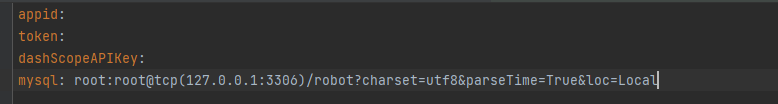
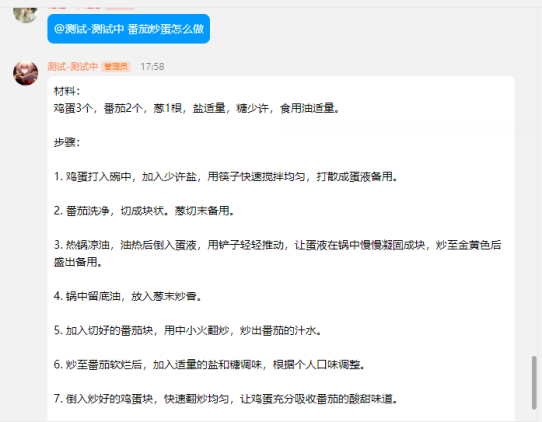

# qq机器人

## 快速运行
1. 修改config/config.yaml中的配置

2. 运行程序
````
go run main.go
````

## 功能介绍
1.成语接龙
2.对话

## 指令介绍
- /成语接龙:开始或重启游戏，当前无游戏进行时输入该指令则开始游戏，当前正在进行游戏则为重启游戏命令
- /quit:退出游戏

## 功能运行示例
1. 成语接龙
- 游戏规则：成语接龙游戏规则：以用户发送的第一个成语作为开头，后续需根据四字成语的最后一个字，作为成下一个成语的开头字进行接龙，
用户必须在60秒内回复且为四字词语。当机器人没有在词库中找到合适的四字成语时，则判定用户胜利
- /成语接龙运行效果图


- /quit运行效果图


2.对话：用户可以通过在消息中@机器人,向其提出各种问题和查询。机器人将会根据用户的输入，生成相应的回复信息并返回给用户。
- 对话运行效果图

