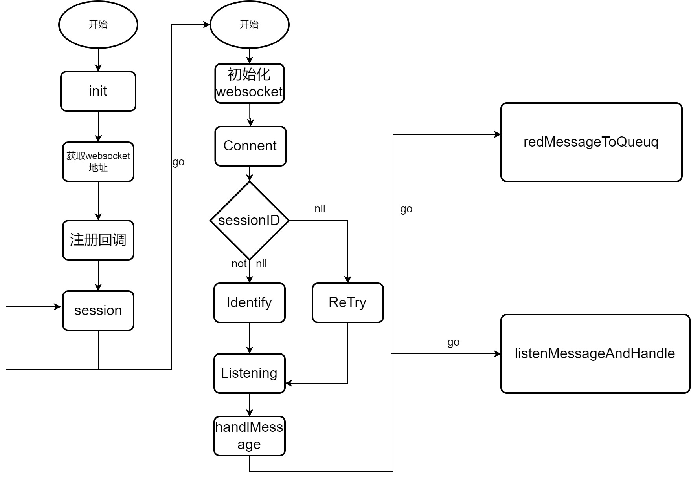

# qq机器人设计文档
  ## 1.实现目标

  功能：成语接龙、对话

  1. 实现网络通信和成语接龙游戏逻辑
     1. 建立通信
     2. 加载成语库并构建Map
     3. 实现成语接龙游戏逻辑

  2. 对接GPT实现对话功能
     1. 集成GPT第三方平台API
     2. 将用户输入转发给GPT,并将响应结果返还给用户

  ## 2.需求分析

  ### 功能需求：

   本质上是实现一个对话机器人，采用WebSocket来做消息的传递实现双方互发消息。其次从功能角度来说：
  - 成语接龙：进行数据采集，将其添加一个txt文件，将词语加载到内存中，并使用map进行储存，其key为词语首个字符、value为词语，使用map的结构更加高效的锁定下个词语，并需要当前机器回复词语来判断用户回答是否正确以及游戏状态（退出，进行）
  - 对话功能：主要通过对接gpt第三方平台，通过将用户的输出词发送给gpt获取用户生成的回复，并将信息返还给用户

   实现的关键点： 

  1. 网络通信的实现 
  2. 对成语库以及游戏逻辑的处理
  3. 对接第三方平台gpt实现对话

  - 非功能需求：
    - 响应速度：定义机器人响应消息的时间标准。
    - 可用性：确保机器人稳定运行，用户消息都会有回复。
    - 可扩展性：便于未来功能的增加和修改。

  ## 3.整体设计

  ### 3.1模块划分

  - common:主要包括clients、model、service、type
           clients存放各种存储客户端的实现,如 MySQL、Redis 等,为后续的功能拓展预留
           model定义MySQL表结构的实例,并通过类方法提供相关的数据操作方法。
           service实现 HTTP、WebSocket 等服务支持
           type定义项目运行所需的各种结构体
  - config:存放程序运行所需的配置文件
  - constant:程序全局常量的声明,目前分为:constant(全局单个数据常量定义),global(全局切片，map等常量定义)
  - server:提供服务，在本文中只涉及成语接龙以及对接GPT对话
  - static:项目静态资源存储文件夹
  - test:项目测试文件夹，测试文件会放在与被测试模块同级的目录下,涉及多个模块或流程的测试文件会放在 test 包中。

  ### 3.2详细设计

  #### 3.2.1整体架构

  这个项目的整体架构可以概括为四个主要部分:

  第一部分负责初始化工作,包括读取配置文件、连接数据库、加载成语库等,同时还会创建一些必要的数据结构。

  第二部分则专注于 WebSocket 的管理,负责创建 WebSocket 连接、进行鉴权认证,并启动两个协程分别处理消息的读取和处理。

  第三部分是一个专门的协程,它不断从 WebSocket 连接中读取消息,并将其写入到一个消息队列中。

  第四部分则是另一个协程,它负责从消息队列中读取消息,根据消息的类型调用相应的回调函数进行处理。在这一部分,项目中实现的成语接龙和对话
  功能的具体逻辑都被包含其中。

  - main

    init函数负责配置数据,http,mysql,成语库的初始化、获取websocket连接以及注册回调函数并将一些信息初始化session。然后main程序
    会阻塞在下面的for循环中，每次从管道里读取到一个Session，就会创建一个协程并发起一个WebSocket连接。

  - WebSocket

    WebSocket连接的建立，以及最后会阻塞在Listening()函数的调用中具体步骤大致包括四部分：
    创建wsClient :=NewWebsocket(session)、连接wsClient.Connect()、鉴权wsClient.Identify()、监听wsClient.Listening()，在Listening函数中，会启动两个协程分别去处理消息读取和消息处理

  - readMessageToQueue

    该协程读取WebSocket收到的消息，然后往队列messageQueue里面写

  - listenMessageAndHandle

    该协程会不断从messageQueue里面读取消息，然后根据消息中的Type来进行处理，调用相应的回调函数，完成实现的功能

  #### 3.2.2功能实现
  - 成语接龙:：
      1. 该模块会读取一个以逗号分隔的成语 TXT 文件,并将其加载到一个 map 数据结构中。map 的 key 为成语的第一个字符,value 为包含该字符开头的成语列表。
      2. 在游戏过程中,当用户输入一个成语时,模块会根据该成语的最后一个字符查找 map,随机选择一个符合条件的成语作为答案返回给用户。
      3. 模块中的 `currentIdiom` 变量用于记录机器人上次给出的成语,便于判断用户是否回答正确。 
      4. FinishOrNot 变量则用于标记游戏是否结束。当游戏开始时,模块会启动一个计时器(timer)来记录游戏的进行时间。每当用户回复消息时,模块都会刷
      新计时器,重置为最初的时间。若在规定时间内用户未能正确回答,则游戏结束,FinishOrNot 变量被设置为 true。当游戏结束时,currentIdiom会被重置
      为空字符串,FinishOrNot 也会重置为 false,同时计时器会停止工作,为下一轮游戏的开始做好准备。

  - -对话： 
      1. 对话模块负责与用户进行简单的对话互动。它会将用户的输入信息传递给 GPT 模型,并获取响应结果,最后返回给用户。

  # 4.测试计划

  测试目标：
  - 确保QQ机器人各项功能正常运行，无遗漏、无错误
  - 验证机器人的性能满足需求规格，如：响应速度

  测试内容：
  - 功能测试：覆盖所有功能点，确保每个功能都按预期工作。
  - 性能测试：模拟场景，测试机器人的响应时间和处理能力。

  测试方法：

  - 单元测试：针对重要模块或函数进行独立测试，确保模块的正确性。
  - 黑盒测试：从用户角度进行测试，不关心内部实现，只关心功能否符合预期。